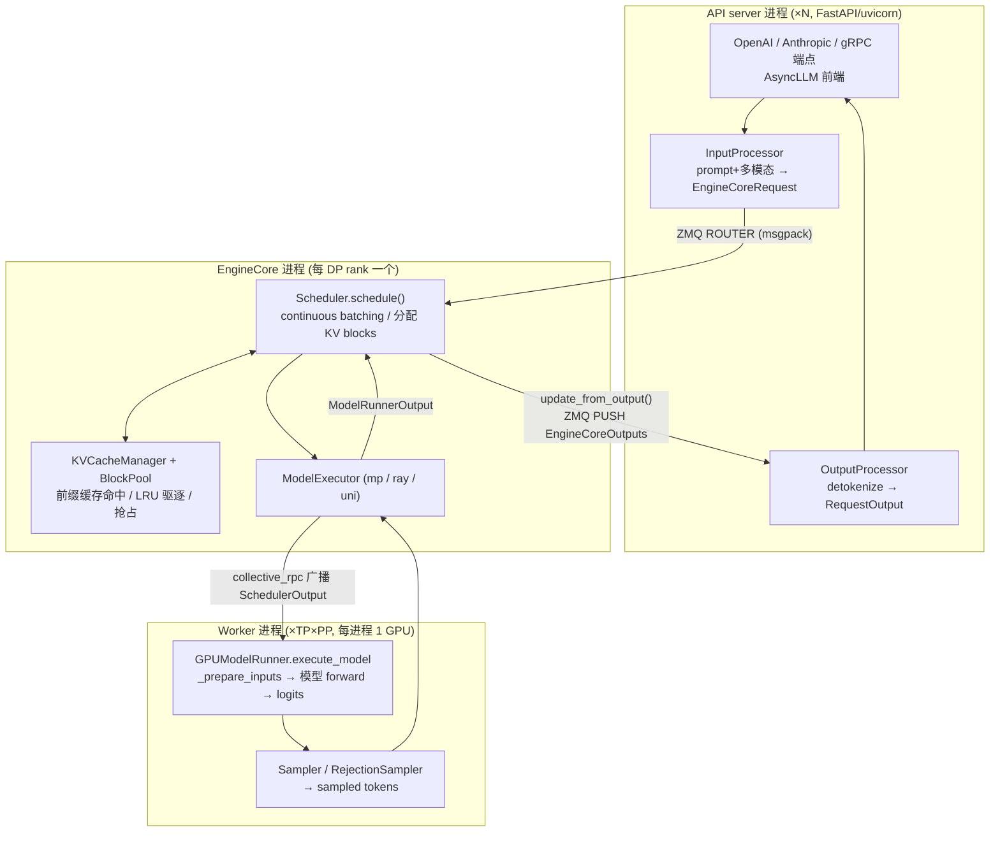

# vLLM 知识库总览

> 基于 vLLM main（`9f07d023d0`，2026-09-23），最新 tag **v0.30.1rc0**（`153242a314`，2026-09-23，release candidate；上一正式 release 为 v0.30.0，`9ed533eb4a`，2026-09-20）。v1 架构为默认且唯一的活跃引擎，v0 引擎已完全移除。本文是整个知识库的入口：先给全局地图，再导读 8 个子系统，最后给快速上手与部署优化速查。

## 1. vLLM 是什么
<!-- tags: intro, overview, 简介 -->

vLLM 是一个高性能 LLM 推理与服务引擎，核心贡献是 **PagedAttention**（KV cache 分页管理）与 **continuous batching**（每步动态组批），并在此之上构建了一套生产级 serving 栈：OpenAI 兼容 API、TP/PP/DP/EP 分布式、量化、投机解码、结构化输出、P/D 分离等。

**v1 架构的核心思想**（相对 v0 的重写）：

1. **前后端进程解耦**：调度器（Scheduler）与模型执行（ModelRunner）运行在独立的 **EngineCore 进程**，前端（API server / 离线 `LLM` 客户端）通过 **ZMQ + msgpack** 与之通信；ZMQ IO 在独立线程，可与 GPU 前向重叠。
2. **continuous batching 原生内建**：没有 "prefill phase / decode phase"，每个请求只有 `num_computed_tokens` 与 `num_tokens_with_spec` 两个计数器，调度器每步的目标是让前者追上后者——chunked prefill、prefix caching、speculative decoding 都是这一统一模型的推论。
3. **KV cache = block pool + 自动前缀缓存（APC）**：`BlockPool` 物理块池 + 链式块哈希，LRU 驱逐；抢占只有 **recompute**（无 v0 的 CPU swap）。
4. **async scheduling**：调度与执行重叠（`max_concurrent_batches=2`），默认按 executor 能力自动开启。
5. **编译与 CUDA Graph 深度集成**：`torch.compile`（`VLLM_COMPILE` 模式，piecewise 切图 + 自定义 Inductor pass）+ CUDA Graph（默认 `FULL_AND_PIECEWISE`：decode 整图 replay，prefill/mixed 走 piecewise）。
6. **Model Runner V2（v0.29 起默认）**：GPU 执行层重构为 `vllm/v1/worker/gpu/` 下的模块化 runner（`use_v2_model_runner` 默认 True），旧版 `gpu_model_runner.py` 降为 legacy 回退（`VLLM_USE_V2_MODEL_RUNNER=0`）。HiSparse、watermarking 等新特性强制要求 V2。

## 2. 架构地图
<!-- tags: architecture, map, 架构, dataflow, 数据流 -->

### 2.1 主数据流（一次 `/v1/chat/completions` 请求）
<!-- tags: dataflow, request, api-server, enginecore, worker, zmq, 数据流 -->



要点：

- **前端可选 Rust 实现（v0.28 新增，实验性）**：`rust/` 的 `vllm-frontend-rs` 用 axum 重建北向 OpenAI 兼容 HTTP 层，仍经 ZMQ + MessagePack 走既有 engine 边界，`VLLM_USE_RUST_FRONTEND=1` 启用（默认 `0`，生产仍用 Python 前端）。
- **`EngineCore.step()`**（`vllm/v1/engine/core.py:634`）是引擎内环：`scheduler.schedule()` → `executor.execute_model(non_block=True)` → `get_grammar_bitmask()` → `executor.sample_tokens()` → `scheduler.update_from_output()`。
- **`execute_model` 与 `sample_tokens` 分离**，让 forward 的 GPU kernel 入队后 CPU 可继续准备下一步（async scheduling 的基础）。
- 同步离线路径（`LLM.generate`）走 `SyncMPClient` + 用户循环 `step()`；在线路径（`AsyncLLM`）走 `AsyncMPClient` + 后台 `output_handler` 协程流式 yield。
- 进程拓扑：主进程（launcher）→ N 个 API server 子进程 + DP 个 EngineCore 进程 → 每个 EngineCore 经 `MultiprocExecutor`/`RayDistributedExecutor` 拉起 TP×PP 个 Worker 进程。

### 2.2 横切层（自底向上）
<!-- tags: layers, 分层, distributed, attention, quantization, 执行层 -->

```
┌──────────────────────────────────────────────────────────────────┐
│ 分布式层  parallel_state (TP/PP/DP/EP/PCP/DCP 进程组)             │
│   custom all-reduce / NCCL symm-mem / all2all (DeepEP/NIXL/MoRI) │
│   KV connector (P/D 分离: NIXL/LMCache/Mooncake) · EPLB · Elastic EP
├──────────────────────────────────────────────────────────────────┤
│ Attention 层  FLASH_ATTN / FLASHINFER / TRITON_ATTN / FLEX /     │
│   FLASHMLA / FLASHINFER_MLA / CUTLASS_MLA …（按平台+能力自动选择）│
├──────────────────────────────────────────────────────────────────┤
│ 量化层  FP8 / AWQ / GPTQ / ModelOpt(NVFP4) / MXFP4 / 在线量化 …  │
│   QuantizationConfig → QuantizeMethod → kernel 选择器 (scaled_mm)│
├──────────────────────────────────────────────────────────────────┤
│ 模型层  model_executor: 380+ 模型架构 + 并行算子                  │
│   (ColumnParallelLinear / RowParallelLinear / FusedMoE / RMSNorm)│
├──────────────────────────────────────────────────────────────────┤
│ 执行层  torch.compile (VLLM_COMPILE, piecewise + 自定义 pass)     │
│   + CUDA Graph (FULL_AND_PIECEWISE) + 显存 profiling             │
└──────────────────────────────────────────────────────────────────┘
```

### 2.3 配置体系
<!-- tags: vllmconfig, config, 配置, engineargs, 解析链 -->

所有配置聚合在 `VllmConfig`（`vllm/config/vllm.py:355`）：`model_config` / `cache_config` / `parallel_config` / `scheduler_config` / `compilation_config` / `attention_config` / `speculative_config` / `kv_transfer_config` / `quant_config` / `lora_config` / `observability_config` …。解析链：**CLI flag → `EngineArgs`（`vllm/engine/arg_utils.py:447`，字段名与 flag 一一对应）→ `create_engine_config()` 逐个子 config → `VllmConfig.__post_init__` 跨 config 推导**（如按 executor 能力定 `async_scheduling`）。环境变量集中在 `vllm/envs.py`。

## 3. 子系统导读
<!-- tags: index, navigation, 导读 -->

| # | 子系统 | 一句话概括 | 子文档 |
|---|--------|-----------|--------|
| 01 | 核心架构与请求生命周期 | v1 进程/线程模型（API server ↔ ZMQ ↔ EngineCore ↔ Worker）、`EngineCore`/`EngineCoreClient` 类族、请求完整数据流与 `VllmConfig` 配置体系 | [01-architecture-core](./01-architecture-core.md) |
| 02 | 调度与 KV Cache | 统一 token 模型的 `Scheduler`（continuous batching、chunked prefill、recompute 抢占）、`KVCacheManager`/`BlockPool` 块池与自动前缀缓存、`num_gpu_blocks` 容量计算、KV offload | [02-scheduling-kv-cache](./02-scheduling-kv-cache.md) |
| 03 | 模型执行与编译优化 | `GPUModelRunner` 的 step 主流程（`_prepare_inputs`/`ForwardContext`）、权重加载与 TP 切分、`torch.compile` piecewise 编译、CUDA Graph capture/dispatch、显存 profiling | [03-model-execution](./03-model-execution.md) |
| 04 | Attention 后端与底层算子 | "一个 backend = 三个类"的抽象与自动选择机制、FLASH_ATTN/FLASHINFER/TRITON/MLA 各 backend 适用场景、`csrc/` CUDA kernel 与 Triton kernel 清单、切换旋钮 | [04-attention-kernels](./04-attention-kernels.md) |
| 05 | 分布式并行与 KV 传输 | TP/PP/DP/EP/PCP/DCP 的 rank 布局与进程组、all-reduce/all2all 通信后端、Executor 层、P/D 分离（KV connector）、EPLB 与 Elastic EP | [05-distributed](./05-distributed.md) |
| 06 | 量化与多硬件平台 | 量化方法全景（FP8/AWQ/GPTQ/ModelOpt/MXFP4/在线量化/KV 量化）与 kernel 选择器、`Platform` 抽象与 CUDA/ROCm/CPU/XPU/TPU 各平台部署要点 | [06-quantization-hardware](./06-quantization-hardware.md) |
| 07 | 投机解码与高级特性 | draft+verify 投机解码（ngram/EAGLE/MTP/draft_model…）与 `RejectionSampler`、`Sampler` 采样链、结构化输出（xgrammar bitmask）、LoRA 多适配器、多模态、reasoning parser | [07-advanced-features](./07-advanced-features.md) |
| 08 | 部署、API 服务与性能调优 | CLI 入口与 Docker 镜像、OpenAI 兼容端点清单、关键 `VLLM_*` 环境变量、吞吐/延迟/显存调优指南、部署决策树与压测工具 | [08-deployment-optimization](./08-deployment-optimization.md) |

## 4. 快速上手
<!-- tags: quickstart, 入门, llm-class, serve, docker -->

### 4.1 离线推理（Python `LLM` 类）
<!-- tags: llm-class, offline, 离线推理, generate, sleep-mode -->

```python
from vllm import LLM, SamplingParams

llm = LLM(model="meta-llama/Llama-3.1-8B-Instruct",
          tensor_parallel_size=2, max_model_len=8192,
          gpu_memory_utilization=0.90)
out = llm.generate(["Hello"], SamplingParams(temperature=0.7, max_tokens=128))
```

适合批量推理、评测、脚本；`LLM` 还支持 `chat()` / `embed()` / `classify()` / `score()`、`sleep()/wake_up()`（sleep mode）、`reset_prefix_cache()`。

### 4.2 在线服务（`vllm serve`）
<!-- tags: serve, online, api-server, openai, 在线服务 -->

```bash
vllm serve meta-llama/Llama-3.1-8B-Instruct \
  --host 0.0.0.0 --port 8000 \
  --tensor-parallel-size 4 \
  --max-model-len 32768 \
  --served-model-name my-model
```

启动 OpenAI 兼容 HTTP API（`/v1/chat/completions` 等，OpenAI SDK 直接可用，`base_url="http://host:8000/v1"`）；也支持 `--grpc`、`--headless`（多节点 DP 从节点）、`--config config.yaml`。

### 4.3 Docker
<!-- tags: docker, 镜像, ipc-host, cache, nonroot -->

```bash
docker run --rm --gpus all --ipc=host -p 8000:8000 \
  -v ~/.cache/huggingface:/root/.cache/huggingface \
  -v vllm-cache:/root/.cache/vllm \
  vllm/vllm-openai:latest meta-llama/Llama-3.1-8B-Instruct
```

`--ipc=host` 是多进程共享内存必需；挂载 `vllm-cache` 持久化 `torch.compile` 缓存可让二次启动免编译。非 root 用 `vllm-openai-nonroot` 镜像 + `--user 2000:0`。

## 5. 部署优化速查
<!-- tags: deployment, tuning, 速查, cheatsheet -->

浓缩自 [08-deployment-optimization](./08-deployment-optimization.md) 的调优要点：

| 目标 | 关键旋钮 | 说明 |
|------|---------|------|
| **吞吐** | `--max-num-batched-tokens`、`--max-num-seqs` | 最核心的两个旋钮（默认按硬件：H100 8192-16384/1024，A100 2048-8192/256）；`--performance-mode throughput` 自动翻倍；小模型大卡可拉到 16384 |
| **延迟** | `--performance-mode interactivity`、较小的 `max_num_batched_tokens` | 细粒度 cudagraph capture（1..32）；decode 不被长 prefill 拖慢，改善 ITL/TPOT |
| **显存** | `--gpu-memory-utilization`（默认 0.92）、`--kv-cache-dtype fp8`、`--max-model-len` | KV 显存 = 请求显存 − 权重 − 峰值激活 − cudagraph 估算；FP8 KV 使 KV 容量约翻倍；`--kv-cache-memory-bytes` 可精确指定 |
| **并行策略** | 单卡放得下→DP 多副本；单节点→`-tp N`；跨节点→`-tp 8 -pp 节点数 --distributed-executor-backend ray`；MoE→`-dp N --enable-expert-parallel --all2all-backend deepep_low_latency` | TP 越大 all-reduce 开销越大，小模型别盲目拉 TP |
| **前缀复用** | `--enable-prefix-caching`（默认开）、`--prefix-caching-hash-algo` | 多轮对话/RAG/few-shot 收益巨大；只省 prefill 不省 decode |
| **编译/启动** | 默认 `-O2`（VLLM_COMPILE + FULL_AND_PIECEWISE）；`--enforce-eager` 仅调试用；挂载 `VLLM_CACHE_ROOT` 持久卷 | 编译缓存命中可省 5~20s+ 启动时间；`--compilation-config` 精细控制 capture sizes |
| **抢占/OOM** | 调高 `gpu_memory_utilization` → 调低 `max_num_seqs` → 加 TP → 加 PP；KV 量化 | v1 抢占是 RECOMPUTE；看日志 `preempted by PreemptionMode.RECOMPUTE` 与 `/metrics` preemption 计数 |
| **投机解码** | `--speculative-config '{"method":"ngram"/"eagle"/"mtp", "num_speculative_tokens":K}'` | ngram 无需 draft 权重最省；EAGLE/MTP 接受率更高；大 batch 用 `num_speculative_tokens_per_batch_size` 动态 K |
| **P/D 分离** | `--kv-transfer-config '{"kv_connector":"NixlConnector","kv_role":"kv_producer"/"kv_consumer"}'` | 长 prefill 与 decode 分池部署，connector 可选 NIXL/LMCache/Mooncake |
| **输入瓶颈** | `--api-server-count`、`VLLM_USE_FASTOKENS=1` | API server 进程横向扩容；Rust tokenizer 加速 tokenize 密集负载 |
| **观测/压测** | `/metrics`（Prometheus）、`VLLM_LOG_STATS_INTERVAL`、`vllm bench serve` / `vllm bench sweep` | 盯 queue 长度、`gpu_cache_usage`、preemption、TTFT/TPOT/ITL 分位；上线前压出 P99 基线 |

**部署决策树（浓缩版）**：

```
权重单卡放得下？
├─ 是 → TP=1；要多吞吐 → --data-parallel-size=G（或 G 个实例 + LB）
└─ 否 → 单节点 8 卡放得下？
    ├─ 是 → -tp 8（MoE 大模型改 -dp N --enable-expert-parallel）
    └─ 否 → -tp 8 -pp 节点数 --distributed-executor-backend ray
显存仍紧 → --kv-cache-dtype fp8 → 量化权重 (fp8/awq/gptq) → 降 --max-model-len → --cpu-offload-gb
```

**上线前检查清单**：启动日志确认 `GPU KV cache size` 与 `Maximum concurrency` 满足业务并发且无 preemption；编译缓存已持久化；`--api-key` 只保护 `/v1` 前缀（`/health` 等不鉴权，生产放反向代理后）；多节点每节点设 `VLLM_HOST_IP` + `--ipc=host`；`/metrics` 接告警。

## 6. 关键文件（顶层索引）
<!-- tags: files, 源码索引 -->

| 路径 | 作用 |
|------|------|
| `vllm/v1/engine/core.py` | `EngineCore` / `EngineCoreProc`：引擎内环 + ZMQ 包装 |
| `vllm/v1/engine/core_client.py` | `EngineCoreClient`（Inproc/SyncMP/AsyncMP/DP* 前端客户端） |
| `vllm/v1/engine/async_llm.py` / `llm_engine.py` | 在线 `AsyncLLM` / 同步 `LLMEngine` 前端 |
| `vllm/v1/core/sched/scheduler.py` | `Scheduler`：调度、抢占、KV 集成 |
| `vllm/v1/core/kv_cache_manager.py` / `block_pool.py` | KV cache 块管理与前缀缓存 |
| `vllm/v1/worker/gpu/model_runner.py`（V2，默认）/ `gpu_model_runner.py`（V1 legacy）/ `gpu_worker.py` | ModelRunner 主逻辑 / Worker 初始化与显存 profiling |
| `vllm/v1/executor/multiproc_executor.py` | 默认多进程 worker 编排 |
| `vllm/v1/attention/` | attention backend 抽象、选择器与实现 |
| `vllm/compilation/` | torch.compile 集成、CUDA Graph |
| `vllm/distributed/` | 进程组、通信后端、KV transfer、EPLB、Elastic EP |
| `vllm/model_executor/` | 模型定义、算子层、权重加载、量化 |
| `vllm/config/vllm.py` | `VllmConfig` 聚合与推导 |
| `vllm/engine/arg_utils.py` | `EngineArgs`：全部 CLI 参数与默认值逻辑 |
| `vllm/entrypoints/` | CLI（`serve`/`bench`/`run-batch`/`snapshot`）、OpenAI 端点、`LLM` 类 |
| `vllm/snapshot/` | **v0.30 新增**：initialized engine snapshots（CRIU 引擎快照，`vllm snapshot create/restore`） |
| `rust/`（`vllm-frontend-rs`） | Rust 前端（实验性，v0.28+）：axum HTTP + ZMQ engine client |
| `vllm/envs.py` | 全部 `VLLM_*` 环境变量注册表 |
| `docker/Dockerfile` | 官方镜像（`vllm-openai` 等 target） |

## 7. 增量更新记录
<!-- tags: changelog, 增量更新, baseline, 基线 -->

- **2026-09-24**：基线从 `d90f0eade5`（2026-09-22，v0.30.0）推进到 `9f07d023d0`（2026-09-23，最新 tag **v0.30.1rc0**，`153242a314`，2026-09-23 release candidate）。区间 69 commits。主要变更：
  - **投机解码**：DSpark 支持 PP（#56956，`pp_utils.py` 的 `PPHandler.set_disabled()` + `broadcast_drafts` 折叠进 `post_update`）；Kimi-K3 变长 decode（#52988，MLA/KDA metadata builder 支持 `max_query_len`，`FlashInferMLADecodeMetadata` 数据类化）；异构 vocab spec decode 去掉 CPU-GPU 同步（#57396）；GLM MTP head 延迟加载（#55442，`defer_lm_head`）；MRV1+PP>1+async sched+structured output 组合禁止（#56250）。详见 02/04/05/07/08。
  - **结构化生成/解析**：DiffusionGemma 结构化生成（#57250，`DiffusionAsyncScheduler` + `validate_diffusion_sampling_params`）；Granite 流式 tool-call 解析（#49648，`parser/granite.py` 新文件）；length finish_reason 流式 tool call 修复（#46303）；FIM completion 渲染（#44229，`DeepseekV4Renderer.render_completion_suffix`）。详见 01/07/08。
  - **MoE/量化**：MoE gate 统一 `GateLinear`（#58234，33 个模型文件切换）；TritonExperts EP 丢弃远端专家 top-k slot（#58051）；Humming wNaM 非对称量化（#46528，`zero_point` 支持，`WNA16_ZP_SUPPORTED_TYPES_MAP` 扩到 {2-8}）；per-token NVFP4 MoE 后端（#57176）；FP8/MLA 权重变换重构（#57732，`split_kv_b_proj()` 纯函数）；DeepGEMM arch capability 优先检查（#58073）；AllSpark INT8 W8A16 GEMM 移除（#58001）。详见 03/06。
  - **编译/启动**：`enforce_eager` 禁用 JIT warmup（#58197/#55146）；`set_torch_threads_for_runtime` 移到 `load_model` 末尾（#55891）；Fast Start DP weight cache daemon（#57386）；`with_hf_config` 子模型视图跳过 `__post_init__`（#58212）；ModelState `max_model_len` 从 model config 读取（#58149）。详见 01/03/08。
  - **分布式/平台**：AuxOutput KV connector 限制收窄为 5 个具名 PD connector（#58150）；batch_invariant NCCL>=2.31 用 `NCCL_ALGO="ring,tree;allreduce:tree"`（#58179）；XPU batch-invariant 支持（#55881）；ROCm MRV2 sampler JIT warmup（#58092）；ROCm BF16 AsyncTP 融合（#58098）；ROCm AITER static FP8 attention output 融合（#58099）；RDNA3/4 narrow KV tile（#58225）；MiniMax MXFP8 zero blocks 修复（#58089）；DSV4/DSV4.1 inverse RoPE 融合（#57451/#57435）；GLM-5.2-MXFP4 ROCm（#51915）；GLM-5.3-Flash dense MLP sequence-parallel shard（#58061）。详见 05/06。
  - **其他**：SM120 NoPE sparse MLA 修复（#55277，`concat_and_cache_ds_mla_kernel` 清零 RoPE 尾部）；encoder-only prefix caching 自动禁用（#58287）；Engram `/dev/shm` 回退（#57914）；Triton softcap NaN 修复（#56579）；EPD metadata-only audio（#57887）；dead code 清理（#58002，-585 行）。详见 02/04/07。
- **2026-09-22**：基线从 `8b98b7d0b4`（2026-09-21，v0.30.0rc2）推进到 `d90f0eade5`（2026-09-22，最新 tag **v0.30.0**，`9ed533eb4a`，2026-09-20 正式 release）。区间 56 commits。主要变更：
  - **Initialized engine snapshots**（#51360，`vllm/snapshot/` 新包 + `vllm snapshot create/restore` CLI）：CRIU + CUDA checkpoint 捕获**已初始化引擎**的进程树快照，restore 时校验环境指纹并复现记录的 token 输出，换取极快激活；实验性，限 Linux x86-64 + 单 NVIDIA GPU + TP1 明文 HTTP，详见 08 §1.1。
  - **KV hints 请求信封**（#53423，`vllm/v1/kv_hints/`）：orchestrator 可编程 KV 管理提示（`KvHintsEnvelope`/`KvHintAction`，版本化 action），经 `InputProcessor`→`Request`→`ReqContext` 贯通到 KV offload tiering（KVCR 的 router hint 改用此信封）。详见 02 §3.3。
  - **调度器**：`long_prefill_token_threshold` 软化（#57951）——batch 中只有 1 个请求时不再截断其 prefill chunk（无人可饿死）；`ParallelConfig.nnodes_within_dp` 修复 external LB 下 DP rank 数超过节点数时 floor 到 0 的问题（#53743，external LB 时 `max(...,1)`，非 external 且不可整除直接报错）。详见 02/05。
  - **投机解码**：DFlash 启用 async scheduling（#58065）；draft 模型配置覆盖统一为 `SpeculativeConfig.apply_draft_overrides`（`moe_backend`/`attention_backend`/`kv_cache_dtype` 仅非 None 时覆盖 target，`config/speculative.py`）；draft 加载统一走 `get_draft_load_config`（`model_loader/utils.py`）——Fast Start（`ipc_cache`）下 MTP draft 模型缓存到 daemon 独立 draft group（#57312）；DFlash/DSpark profiling query batch 上限（#56448）；MTP draft KV cache group 位置标注通用化（#55390，`kv_cache_utils.py` 的 trailing-layer fallback 从 DSV4 专属扩到所有 `method="mtp"`，含 DSV4.1 DSpark）。详见 02/03/07。
  - **Attention**：GLM5Next **NoPE sparse-MLA**（head_size 512、`qk_rope_head_dim=0`）接入 FA/FlashMLA（#55385，`FLASHMLA_SPARSE` 支持 512 仅限 SM90 bf16 NoPE；FA3 QV 路径用 64-wide 零 Q 占位）；sparse MLA 准备开销削减（#57458，`sparse_utils.py` index-remap kernel 重构）；ROCm DSV4 自适应验证走 flattened device query lens（#52362）；GDN stateless first-chunk 分类修复（#51565，`gdn_attn.py` 用 `seq_lens_cpu_upper_bound` 区分首 chunk prefill 与 capture batch）。详见 04。
  - **多模态**：processor/receiver cache 从 `multimodal/cache.py` 单文件重构为 `multimodal/cache/` 包（`base.py`/`lru.py`/`shm.py`/`factories.py`，`worker_receiver_cache_from_config` 等工厂从 registry 迁出）；`supports_multimodal_inputs` 从 registry 移到 `ModelConfig` 缓存属性（#57913）；Qwen2.5-VL 视频 fps 用于 temporal M-RoPE（#47736）。详见 07。
  - **量化/平台**：MXFP4 emulation 加载期反量化（#50814，`VLLM_MXFP4_EMULATION_DEQUANT_AT_LOAD`，对齐已有 MXFP8 开关）；`VLLM_KIMI_K3_GEMM_RS` 更名 `VLLM_ENABLE_GEMM_RS`（#57428，GEMM-RS 融合 kernel 从 Kimi-K3 专属扩到 DSV4.1 `wo_b`，`kernels/linear/cute_dsl/gemm_rs_ar.py` 新增 1177 行）；`VLLM_PLE_CPU_OFFLOAD` 移除（Engram `cpu_offload` 固定默认 True）；CPU 新增 `--device-memory-utilization` CLI 别名（#56547，`CacheConfig.device_memory_utilization` property）。详见 06/08。
  - **分布式**：NIXL DCP 跨 MLA cache region 的 pull 修复（#57389，`nixl/base_worker.py` 按全局 DCP 位置对齐 block + region 分组校验）；ROCm 显式拒绝 DSV4 FSE=1 + DPA+ETP 组合（#57919）。详见 05。
  - **sleep mode**：level-2 sleep 保留冻结权重（#57891，`ModelConfig.sleep_preserve_parameter_names`（CLI `--sleep-preserve-parameter-names`）按 glob 保留指定参数跨 sleep，RL 场景免重传）；`gpu_worker.py` 新增 `_save/_restore_sleep_parameters`。详见 08。
  - **安全/校验**：拒绝超过填充后 `max_tokens` 默认的 `min_tokens`（#57731，`input_processor.py`）；拒绝空 `structural_tag`（#47450，`sampling_params.py`）；grammar poll 改非阻塞（#55931，`structured_output/request.py` 用 `Future.done()` 替代 100µs timeout）；prompt embeds 的 `is_token_ids` 长度校验（#57006）。详见 01/07。
  - 其他：Rust frontend 系列（parser-owned output grammar #55269、MiMo V2.5 parser #57933、vision processor spec #58109、mm-processor benchmark #51922）；ROCm Qwen GDN 输出 norm 省 reshape（#47842）；ROCm fused shared-expert gate GEMM 走 platform dispatcher（#54185）；fused silu-mul block-quant fast path 在 swiglu clamp 时跳过（#57984）；MoE 拒绝 monolithic backend 不支持的 hash routing（#57867）；chunked long-text embedding 归一化修复（#57498）。详见 03/06/07。
- **2026-09-12**：基线从 `f32b17b6d6`（2026-08-21，v0.28.0rc1）推进到 `2f59050eda`（2026-09-12，最新 tag **v0.29.0**，`98dff2a81d`）。区间 985 commits。主要变更：
  - **Model Runner V2 成为默认**（`use_v2_model_runner` 默认 True，`vllm/v1/worker/gpu/` 模块化 runner；旧 `gpu_model_runner.py` 降为 legacy 回退）。详见 03 §1。
  - **KV cache 物理布局重构**（RFC #42082）：新增 `vllm/v1/kv_cache_layout.py` 的 `KVCacheLayout` 枚举（`LBNHC/LBHNC/LHBNC/BLHNC/BLNHC/BHLNC` + 兼容 `NHD/HND`），`VLLM_KV_CACHE_LAYOUT` 扩展为 7 种取值。详见 02 §5。
  - **HiSparse**（host-resident sparse-MLA decode 热缓冲，`vllm/v1/hisparse/`，强制 V2）+ **Engram/PLE**（n-gram 嵌入存储与分片，`vllm/config/engram.py` + ETP 进程组）。详见 02/05。
  - **文本水印 watermarking**（`vllm/v1/watermarking/`，Gumbel-max + Philox PRF，`--watermark-config`，强制 V2）。详见 07。
  - **调度器队列上限**：`SchedulerConfig.max_num_queued_reqs` / `max_num_queued_tokens`（`--max-num-queued-reqs`/`--max-num-queued-tokens`）。详见 02。
  - **投机解码**：新增 `dflash2`、`gemma4_mtp`、`qwen4_exp_mtp`/`hy_v4_mtp`/`glm5_next_mtp` 等 MTP 变体；MTP 模型类型扩到 27 种。详见 07。
  - **Attention**：新增 `B12X`（SM12x paged causal）、`FLASHINFER_MLA_SPARSE_SM90` 等 backend；MLA sparse/indexer 大幅扩展。详见 04。
  - **分布式**：`weight_transfer/` 新增 `sharded_rdt`（分片 RDMA 权重传输）引擎；`parallel_state` 新增 ETP 组与 `suspend/resume_device_comms`。详见 05。
  - **部署**：新增 scale-out 端点（`/v1/chat/completions/render`、`/inference/v1/generate` 等，`VLLM_ENABLE_SCALE_OUT_ENDPOINTS`）。详见 08。
  - 模型架构数从 290+ 增至 **380+**（新增 DeepSeek-V4/V4.1、GLM-5.3-Flash、Qwen4-Exp、Kimi-K3 等）。
- **2026-09-19**：基线从 `2f59050eda`（2026-09-12，v0.29.0）推进到 `751f6807d9`（2026-09-19，最新 tag **v0.30.0rc2**，`fa6ff06066`，release candidate）。区间 419 commits。主要变更：
  - **水印支持投机解码**：新增 `dual_key_gumbel` 算法（双 key gumbel-max，`supports_speculative_decoding=True`，`alpha` 控制 key-B 概率，加权 early-fusion 检测 `vllm/v1/watermarking/gumbel.py:208`）；`spec_decode.py` 新增 `create_speculative_target_watermarker`/`create_speculative_draft_watermarker` 与 `allow_target_only_watermarking`；`_check_watermarking_unsupported`（`vllm/config/vllm.py:1219`）约束 `draft_sample_method='probabilistic'`、`rejection_sample_method='standard'`、method ∈ {dspark,eagle,eagle3,mtp}。详见 07 §7.1。
  - **调度器 RUNNING 准入上限**：`SchedulerConfig.max_num_active_seqs`（`--max-num-active-seqs`，`vllm/config/scheduler.py:70`，`vllm/v1/core/sched/scheduler.py:127-129`，执行点 `vllm/v1/core/sched/scheduler.py:857-858`）；队列上限计数改用 `SharedAdmissionStats`（`vllm/v1/engine/admission_control.py:13`）跨进程无锁计数。详见 02 §2.2。
  - **投机解码自适应验证**：`enable_adaptive_verification`（`vllm/config/speculative.py:539`）+ `OnlineAcceptanceEstimator`（`vllm/v1/worker/gpu/spec_decode/acceptance_estimator.py:313`，501 行，log-odds 线性模型，Triton accumulate/refit/predict kernels）。详见 07 §1.3。
  - **KV offload 增强**：back-pressure（#50045，`vllm/v1/kv_offload/tiering/backpressure.py`）、KVCR（#53624，`vllm/v1/kv_offload/tiering/kvcr/`）、per-request `max_load_tokens`（#55885，`vllm/distributed/kv_transfer/kv_connector/v1/offloading/scheduler.py:367`）、chunked region 注册（#51081）、cgroup 检查（#54014）、MLA compact（#56799）。详见 02 §6.1。
  - **Model Runner V2**：DBO FULL CUDA graph（#51700，实现收敛在 `vllm/v1/worker/gpu/cudagraph_utils.py`）；Fast Start 支持 nnode>1（#55468）。详见 03。
  - **分布式**：MoonEP BF16 all2all backend（#52101，`vllm/model_executor/layers/fused_moe/prepare_finalize/moonep.py`）；DeepEPv2 async finalize（#52781/#57236）；PCP+DCP on sparse-MLA（#56157）；PCP decode-only FULL CUDA graphs（#53867）；NIXL attention-HMA PP push prefill（#50494）；Elastic EP CUDA graph 复用（#54985）。详见 05。
  - **Attention**：新增 `COMPOSITE` backend（`vllm/v1/attention/backends/composite.py`，Triton/FlashInfer 或 Triton/FlashAttention 组合，用于 multimodal prefix attention `mm_prefix`，selector 在 `use_mm_prefix=True` 时自动选择）。详见 04 §4.1。
  - **量化**：Quark 原生 W4A16 INT4/UINT4（#48606，`vllm/model_executor/layers/quantization/quark/schemes/quark_w4a16_int4.py`）；CPU FP8 W8A8 linear/MoE（#49942，`csrc/cpu/sgl-kernels/gemm_fp8_w8a8.cpp` + `moe_fp8_w8a8.cpp`）。详见 06。
  - **部署**：新增 `POST /release_kv_cache_memory` 端点（#44890，`vllm/entrypoints/serve/dev/sleep/api_router.py:31`）；`--enable-scale-out` CLI flag 取代 `VLLM_ENABLE_SCALE_OUT_ENDPOINTS` 环境变量（#55176，`vllm/entrypoints/scale_out/factories.py:72`）。详见 08。
  - **结构化输出重构**：`should_fill_bitmask`/`should_advance` 移除，改用 `_get_constraint_start`（`vllm/v1/structured_output/__init__.py:220`）/`validate_tokens`（`vllm/v1/structured_output/__init__.py:294`）；调度器 grammar 验证迁移到 `structured_output_manager.validate_tokens`（`vllm/v1/core/sched/scheduler.py:2418/2446`）。详见 07。
  - **Engram**：新增 `embedding_across_dp`/`dp_shared_memory` 字段 + 异步预取 + DP 分片（#56512）。详见 07 §7.2。
- **2026-09-20**：基线从 `751f6807d9`（2026-09-19，v0.30.0rc2）推进到 `4868312128`（2026-09-20，最新 tag 仍为 **v0.30.0rc2**，`fa6ff06066`）。区间 30 commits。主要变更：
  - **Humming 特性整合**（#56685）：`utils/humming_utils.py` 拆成 `utils/humming/` 包（`schema.py`/`activation.py`/`linear.py`/`moe.py`），新增 `mxfp6/humming.py` kernel 与 `WeightScale2Type`/`InputQuantizationMode`/`MmaType` 等 schema 类型；显式 input schema 默认禁用 fallback（`allow_fallback` 控制）；Marlin 与 Humming 共享持久 workspace（#57421，`vllm/v1/worker/workspace.py` 新增 `get_persistent_resource`/`get_persistent`）。详见 06。
  - **Model Runner V2 支持自定义 logits processors**（#56497）：`vllm/v1/worker/gpu/sample/logits_processor/`（`interface.py`/`loader.py`）新增，`_get_v2_model_runner_unsupported_features` 移除 "custom logits processors" 限制；`InputProcessor` 在准入时按 runner 选 validator。详见 03/07。
  - **`--enable-mamba-fine-grained-prefix-cache` 更名**（#57382）→ `--enable-mamba-shared-prefix-checkpoint`（`CacheConfig.enable_mamba_shared_prefix_checkpoint`，`config/cache.py:187`），语义不变（EAGLE/MTP 共享前缀 junction 处注册 Mamba align checkpoint）。详见 02。
  - **generate API 暴露 per-request 投机解码指标**（#43310）：Rust frontend `GenerateResponse`/`GenerateStreamResponse` 新增 `metrics.speculative_decoding`（`mean_acceptance_length`/`draft_acceptance_rate`/`acceptance_histogram`/`per_step_*` 等）。详见 07/08。
  - **EPD 动态注册**（#54176）：`disagg_epd_proxy.py` 支持 `--dynamic-registration`，通过 `POST/DELETE /instances`（`X-API-Key`）在线注册/摘除 encode/prefill/decode 实例，带健康探测与自动重连。详见 05。
  - 其他：DeepSeek-V4.1-flash encoder CUDA graph（#56625，`models/deepseek_v41/common/vl_cudagraph.py`）；MiMo V2 bf16 MoE router + mxfp4 MoE（#57784，`GateLinear`）；GLM-5.3-Flash kpool/sparse-indexer 系列修复与性能（#57546/#57534/#57477/#57701/#56810）；SM100 fp8_ds_mla cache scales 修复（#49435）；dead kernel code 清理（#57621，-559 行）。详见 02/04/06。
- **2026-09-21**：基线从 `4868312128`（2026-09-20，v0.30.0rc2）推进到 `86ce4d10e2`（2026-09-21，最新 tag 仍为 **v0.30.0rc2**，`fa6ff06066`）。区间 11 commits。主要变更：
  - **Profiler 统一为平台感知**（#57460）：torch profiling 逻辑从各 worker（`gpu_worker.py`/`cpu_worker.py`/`xpu_worker.py` 各删 22~41 行）收敛到 `vllm/profiler/wrapper.py` 工厂 `create_worker_profiler`（:675）；`ProfilerConfig` 新增 `torch_profiler_activities`（`config/profiler.py:55`，`CPU`/`CUDA`/`PrivateUse1`/`XPU`，缺省按平台默认）；`WorkerProfiler` 基类新增 `should_annotate` 属性（`wrapper.py:60`）。详见 08 §4.9。
  - **sleep 时 KV connector cache reset 失败上抛**（#54581）：`EngineCore` 的 `reset_prefix_cache` 返回 False 时抛 `RuntimeError`（`vllm/v1/engine/core.py:874`），`pause_generation` 的 idle callback 异常经 future 传播而非吞掉。
  - **MoRIIO KV connector 大改**（#51052，+2746 行）：READ 模式传输 hybrid mamba/KDA recurrent state，`moriio_connector.py`/`moriio_layout.py` 重写。
  - 其他：spec decode dummy draft 步不再经 stale block-table 行写 KV（#56734，`vllm/v1/worker/gpu/spec_decode/speculator.py`）；DSV4.1 mHC 小 TP batch 系数 overlap（#57603）；ROCm Engram 表留 host 内存（#57491）；HY4 full CUDA graph capture 记录 indexer completion event（#57811）；XPU communicator world_size 可见性修复（#57779）；Kthena/EPD 文档更新。详见 02/03/06/07。
- **2026-09-21（第二次）**：基线从 `86ce4d10e2`（2026-09-21，v0.30.0rc2）推进到 `8b98b7d0b4`（2026-09-21，最新 tag 仍为 **v0.30.0rc2**，`fa6ff06066`；main 已领先 `v0.30.0` release 分支 310+ commits）。区间 27 commits。主要变更：
  - **AuxOutput Connector**（#45635，`vllm/distributed/aux_output_connector/` + `config/aux_output.py`）：MoE routed-expert 输出按 **KV block hash** 为键持久化到进程内 mmap arena（LRU 驱逐、fail-closed），供外部按 prefix-cache block 读取；`AuxOutputConfig`（`enable_return_routed_experts`/`max_bytes`）挂在 `VllmConfig.aux_output_config`（`config/vllm.py:380`），兼容性校验 `_verify_aux_output_compatibility`（`config/vllm.py:1092`，要求 V2 runner + MoE + prefix caching，拒绝 PP>1/DCP/PCP>1/5 个已知 PD KV connector（Nixl/NixlPull/NixlPush/MoRIIO/Mooncake，#58150 收窄））；scheduler 钩子 `scheduler.py:394/1475/1536/2074/2564`。详见 05 §9.4、02 §2.5。
  - **DSV4.1 mHC 三连**：TP all-reduce 与 mHC 输入准备融合为 MNNVL Lamport multicast CUDA kernel（#57643，`models/deepseek_v41/nvidia/ops/mhc.py:46` `supports_mhc_all_reduce`，TP4/hidden5120/hc_mult4/CUDA_ARCH>=900）；mHC overlap 收紧到 full CUDA graph 捕获路径（#57874，`torch.cuda.is_current_stream_capturing()` 门控，`model.py:413-420`）；ROCm 上禁用 SWA bounded replay（#57906，`models/deepseek_v41/attention.py`，window clamp 只在 FlashInfer/FlashMLA prefill kernel）。详见 05 §4.3、04 §4.2。
  - **ROCm/XPU 平台**：Hy4 ROCm 路径 + backbone compile（#57526，`models/hy_v4/amd/model.py` +718 行）；MiniMax-M3 packed LBHNC AITER QK-norm 融合（#54535）；XPU fused top-k/top-p sampler kernel（#57277，`VLLM_XPU_USE_SAMPLER_KERNEL` 默认开，`topk_topp_sampler.py:129/151`，MRV2 同步接入）；`moe_align_block_size` 7-arg 回退（#57855）；DeepGEMM CUDA 12.9 构建修复（#57554，pin fork `e1f418c2`）。详见 06。
  - **Mamba/KDA prefill checkpoint 通用化**（#57783）：`mamba/checkpoint.py` 抽出 `MambaPrefillCheckpointBuilder`/`Exporter`（ABC），`kda_checkpoint.py` 的 `FlashKDAPrefillCheckpointExporter` 复用，`kimi_k3/nvidia/kda.py`/`kda_metadata.py` 瘦身。详见 03 §3。
  - **多模态 + 结构化输出 bugfix/安全**：receiver cache 优先采用新 payload（#57833，`multimodal/cache.py`，防 stale tensor 顶替新 payload 导致 EngineCore 崩溃）；Molmo2 容忍畸形 EXIF（#57234）；Whisper 30s 上限、Mistral3 grid、DiffusionGemma 修复；xgrammar list-valued `"type"` 归一化（#48416，`backend_xgrammar.py:247`）。详见 07。
  - **Engram DP shared memory 默认开启**（#57651，`config/engram.py:52/86`）：同机 co-located DP replica 默认共享 n-gram 嵌入表 host 内存。详见 07 §7.2。
  - **derender 流式解析文档化**（#57922，`docs/serving/online_serving/derenderer.md`）：scale-out derender 的无状态 `stream_state` 流式协议 + 流式 parity 测试。详见 07 §1。
  - 其他：sparse attention metadata 去冗余（#57885，`mla/indexer.py`/`sparse_swa.py`）；8 个 CI-only commits（XPU/ROCm/Intel job 调整）。
